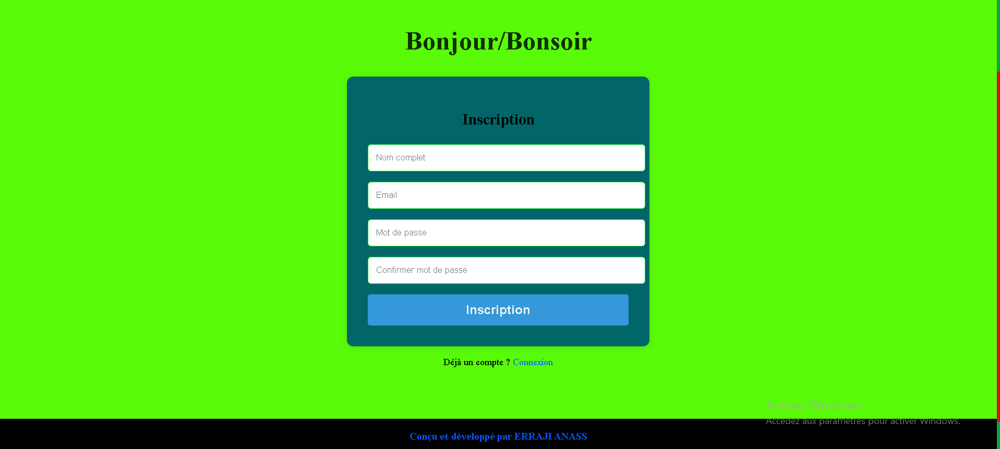
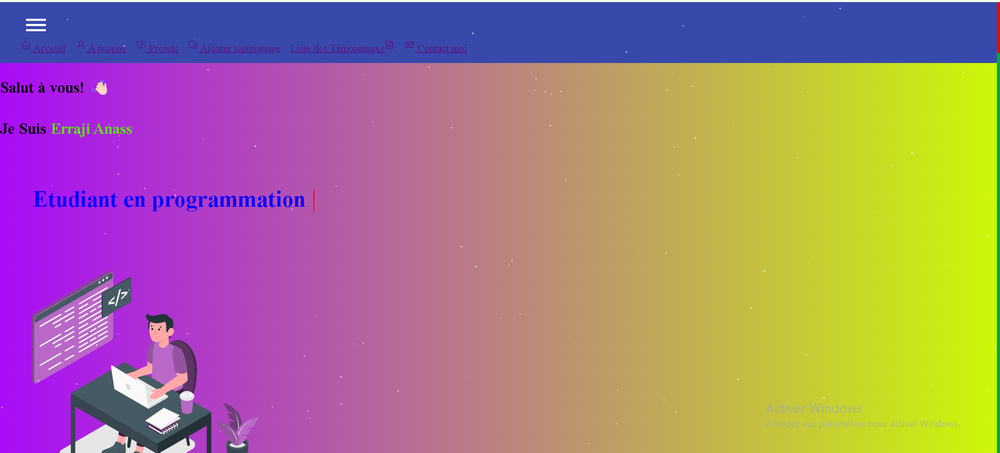
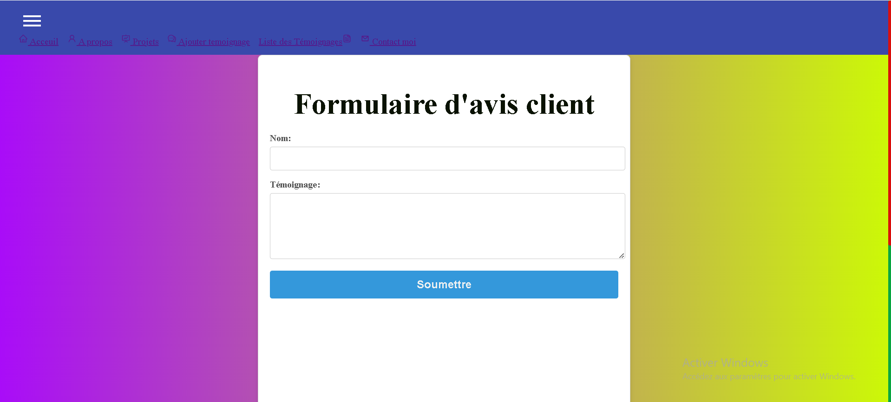
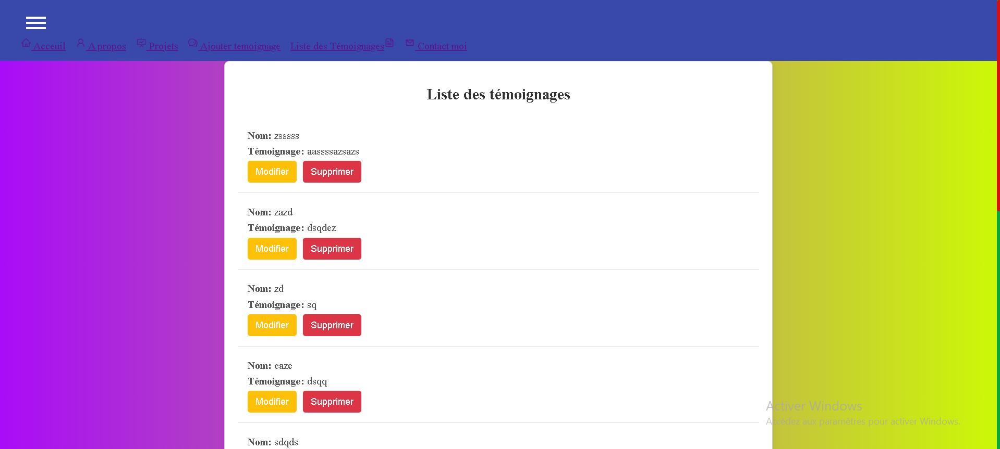
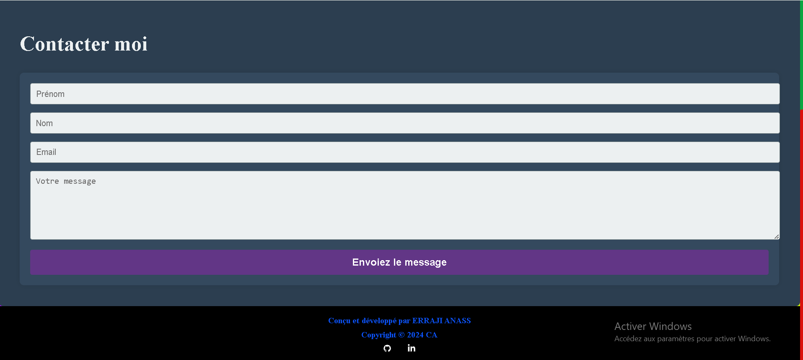

Mon Portfolio

Bienvenue sur mon portfolio personnel ! C'est ici que je présente mes projets, mes compétences et ma passion pour le développement web.

Je m'appelle Anass et je suis un étudiant et développeur passionné par la création de solutions innovantes. Mon expérience dans le développement web m'a permis d'acquérir des compétences solides en HTML, CSS, JavaScript, React et Next.js.

Aperçu du Portfolio Voici un aperçu de mon portfolio :

Page d'accueil : Une page d'accueil accueillante avec une brève introduction et mes projets ainsi que a propos de mes compétences.

Projets : Chaque projet a une page dédiée avec une description claire et la liste des technologies utilisées.

Contact : Vous pouvez me contacter en remplissant le formulaire de contact.

Ajouter temoignage : Vous pouvez ajouter votre témoignage sur mon profil et aussi à propos de mon portfolio.

Liste des Témoignages : C'est une liste des témoignages d'ou vous pouvez voir vos témoignage et aussi les modifier ou supprimer.

<video controls src="20240730-1855-39.9010227.mp4" title="Title"></video>
<video controls src="20240730-1813-57.0297298.mp4" title="Title"></video>

// Comment lancer le projet localement

Clonez ce dépôt sur votre machine locale :

git clone https://github.com/"votre-nom-utilisateur"/My_Portfolio_next.js.git

Installez les dépendances nécessaires :

npm install
# or
yarn dev
=======

yarn install

Lancez l'application en mode développement :

npm run dev
# or
=======

yarn dev

Accédez à l'application dans votre navigateur à l'adresse http://localhost:3000.

Contact Si vous souhaitez me contacter, n'hésitez pas à le faire via "errajianass1@gmail.com" ou sur "https://www.linkedin.com/in/anass-erraji-652b11278/". Je serais ravi d'échanger avec vous !

Merci d'avoir visité mon portfolio ! J'espère que vous apprécierez découvrir mes projets et en savoir plus sur moi en tant que développeur. N'hésitez pas à me laisser vos retours et suggestions.

Let's code and create something amazing together !
